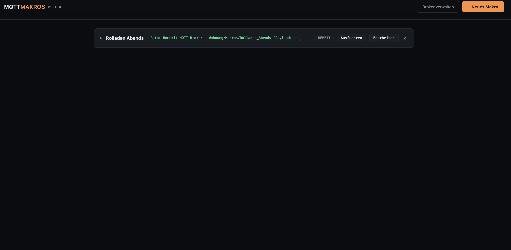

# MQTT Makro-Zentrale



Ein lokal laufendes Web-Tool (`app.py`), das MQTT-Makros zentral
verwaltet und ausfuehrt. Nach dem Start ist es unter
`http://<IP-des-PCs>:8010` im gesamten LAN erreichbar (nicht nur auf
dem Geraet selbst, auf dem es laeuft).

Alle Broker und Makros liegen in `config.json` im selben Ordner wie
`app.py` bzw. wie die spaeter per PyInstaller erzeugte `.exe` /
Binary.

Aktuelle Version: **1.1.1** (wird auch oben rechts auf der Webseite
angezeigt, Quelle: `APP_VERSION` in `app.py`). Was sich in dieser und
frueheren Versionen geaendert hat, steht in [`CHANGELOG.md`](CHANGELOG.md).

## Funktionsueberblick

- **Broker verwalten**: MQTT-Broker anlegen/loeschen (Name, Host,
  Port, optional Benutzername/Passwort, optional TLS). Ein Broker
  kann erst geloescht werden, wenn ihn kein Makro mehr verwendet.
- **Makros anlegen**: Name vergeben, beliebig viele Schritte
  hinzufuegen. Jeder Schritt hat einen eigenen Broker, ein Topic,
  eine Payload, eine Anzahl Wiederholungen sowie eine Wartezeit
  (Sekunden/Minuten) vor dem naechsten Schritt.
- **Auto-Start-Trigger (optional)**: Broker + Topic, optional
  zusaetzlich eine Trigger-Payload. Bleibt die Payload leer, startet
  das Makro bei jeder Nachricht auf dem Topic; ist ein Wert
  eingetragen, nur bei exakter Uebereinstimmung.
- **Live-Ansicht**: Makro-Karten lassen sich aufklappen — dort wird
  bei laufendem Makro der aktuelle Schritt farblich markiert und
  angezeigt, ob gerade gesendet oder gewartet wird. Ein laufendes
  Makro kann nicht ein zweites Mal gestartet, bearbeitet oder
  geloescht werden (nur gestoppt).

## Wie starte und beende ich das Programm?

Das Programm laeuft bewusst **immer mit einem sichtbaren Terminal-/
Konsolenfenster** (kein unsichtbarer Hintergrundprozess), damit es
sich jederzeit einfach beenden laesst.

- **Windows:** Doppelklick auf `MqttMakroZentrale.exe` oeffnet ein
  Konsolenfenster mit den Programm-Logs. **Beenden:** das Fenster
  schliessen (X oben rechts) oder darin `Strg+C` druecken.
- **macOS:** Doppelklick auf `Start-MqttMakroZentrale.command`
  oeffnet automatisch ein Terminal-Fenster und startet darin das
  Programm. **Beenden:** das Terminal-Fenster schliessen oder darin
  `Strg+C` druecken.
  - Direkt aus einem bereits offenen Terminal gestartet: dort
    ebenfalls einfach `Strg+C` druecken.
  - Haengt eine aeltere Version noch im Hintergrund (z. B. eine
    fruehere `.app`-Version ohne Terminalfenster): im Terminal
    `pkill -f MqttMakroZentrale` ausfuehren, oder in der
    Aktivitaetsanzeige nach `MqttMakroZentrale` suchen und dort
    beenden.
- **Router/OpenWrt** (siehe unten): `/etc/init.d/mqttmakro stop` bzw.
  `logread -f` fuer die Logs.

## Benoetigte Python-Pakete

| Paket | Zweck |
|---|---|
| `Flask` | Web-Oberflaeche / REST-API |
| `paho-mqtt` | MQTT-Verbindungen (Makro-Schritte + Trigger) |
| `pyinstaller` | Nur zum Bauen der .exe / Binary benoetigt, nicht zur Laufzeit |

Alle Versionen stehen in `requirements.txt`. Installation (lokal,
zum Testen/Entwickeln):

```bash
python -m venv venv
# Windows:
venv\Scripts\activate
# macOS/Linux:
source venv/bin/activate

pip install -r requirements.txt
python app.py
```

Danach ist die Seite unter `http://localhost:8010` erreichbar, bzw.
im LAN unter der IP des PCs (z. B. `http://192.168.1.20:8010`) —
den Port bei Bedarf in `config.json` unter `server.port` aendern.
Zum Beenden im Entwicklungsbetrieb ebenfalls einfach `Strg+C` im
Terminal druecken.

## PyInstaller-Befehl (lokal, manuell)

Windows (eine einzelne .exe **mit** Konsolenfenster):

```bash
pyinstaller --onefile --name MqttMakroZentrale --collect-all paho app.py
```

macOS (Konsolen-Binary, kein `.app`-Bundle):

```bash
pyinstaller --onefile --name MqttMakroZentrale --collect-all paho app.py
```

Auf dem Mac danach zusaetzlich ein Doppelklick-Startskript daneben
legen (`Start-MqttMakroZentrale.command`, ausfuehrbar per
`chmod +x`), damit sich per Doppelklick automatisch ein Terminal
oeffnet:

```bash
#!/bin/bash
cd "$(dirname "$0")"
./MqttMakroZentrale
```

`--collect-all paho` sorgt dafuer, dass PyInstaller alle internen
Teile von `paho-mqtt` findet (wird sonst gelegentlich nicht
automatisch erkannt). Das Ergebnis liegt danach in `dist/`.

Wichtig: Die `config.json` muss nach dem Bauen manuell in denselben
Ordner wie die `.exe` bzw. die Binary gelegt werden (bzw. wird beim
ersten Start automatisch mit Standardwerten neu angelegt, falls sie
fehlt).

## Installation auf einem Router (GL.iNet Brume 2)

Die Makro-Zentrale kann statt auf einem PC auch direkt auf einem
**GL.iNet Brume 2** (OpenWrt-Router) installiert werden, sodass sie
24/7 mitlaeuft, ohne einen separaten PC dafuer laufen lassen zu
muessen. Schritt-fuer-Schritt-Anleitung inkl. Autostart und
Fehlerbehebung siehe
[`docs/ANLEITUNG-GLiNet-Brume2.md`](docs/ANLEITUNG-GLiNet-Brume2.md).

## Automatischer Build per GitHub Actions

Die Datei `.github/workflows/build.yml` baut bei jedem Push nach
`main`/`master`, bei jedem Tag `vX.Y.Z` und auch manuell (Reiter
"Actions" → "Run workflow") automatisch:

- `MqttMakroZentrale.exe` (Windows, Einzeldatei, mit Konsolenfenster)
- `MqttMakroZentrale-macos.zip` (enthaelt die Konsolen-Binary
  `MqttMakroZentrale` sowie `Start-MqttMakroZentrale.command` zum
  bequemen Doppelklick-Start mit automatischem Terminalfenster)

**Einrichtung:**

1. Repository auf GitHub anlegen (falls noch nicht geschehen).
2. Diese Dateien ins Repository legen (Struktur siehe unten).
3. Push nach `main` — der Workflow startet automatisch; die fertigen
   Dateien stehen danach im jeweiligen Workflow-Lauf unter
   "Artifacts" bereit.
4. Fuer ein "echtes" Release mit Download-Link: einen Tag setzen,
   z. B.:
   ```bash
   git tag v1.1.1
   git push origin v1.1.1
   ```
   Dadurch wird zusaetzlich automatisch ein GitHub-Release mit beiden
   Dateien angehaengt erstellt.

**Erwartete Ordnerstruktur im Repository:**

```
.
├── app.py
├── config.json
├── requirements.txt
├── README.md
├── CHANGELOG.md
├── .gitignore
├── docs/
│   └── ANLEITUNG-GLiNet-Brume2.md
└── .github/
    └── workflows/
        └── build.yml
```

Kein GitHub-Secret noetig — der Workflow nutzt ausschliesslich
Standard-Actions (`checkout`, `setup-python`, `upload-artifact`,
`softprops/action-gh-release`, die alle mit dem automatisch
bereitgestellten `GITHUB_TOKEN` funktionieren).

## Versionierung & Commit-Texte

Bei jeder ausgelieferten Aenderung:

1. `APP_VERSION` oben in `app.py` erhoehen (PATCH = Bugfix/Doku,
   MINOR = neue Funktion, MAJOR = Breaking Change am Config-Format).
2. Neuen Eintrag oben in `CHANGELOG.md` ergaenzen.
3. Den mitgelieferten Commit-Text fuer die jeweilige Aenderung
   verwenden (wird im Chat mitgeliefert).
